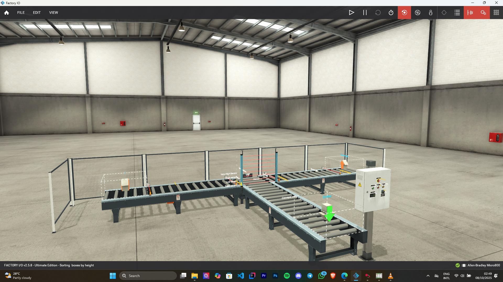
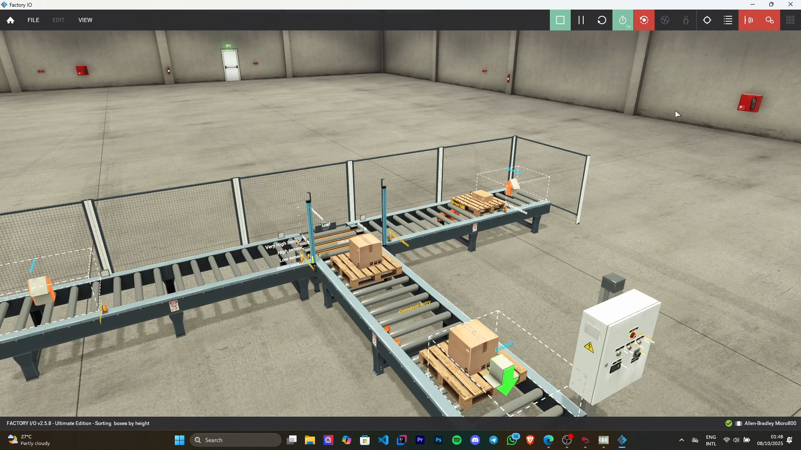
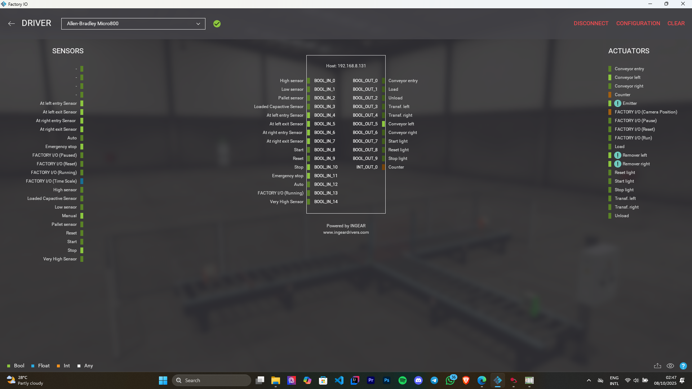
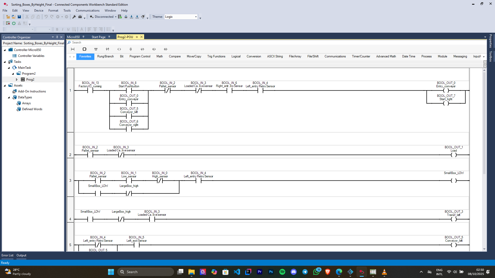
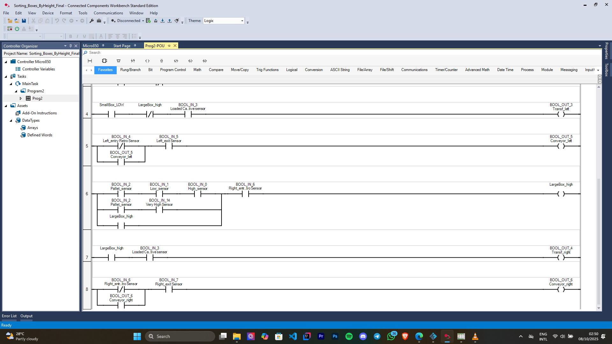
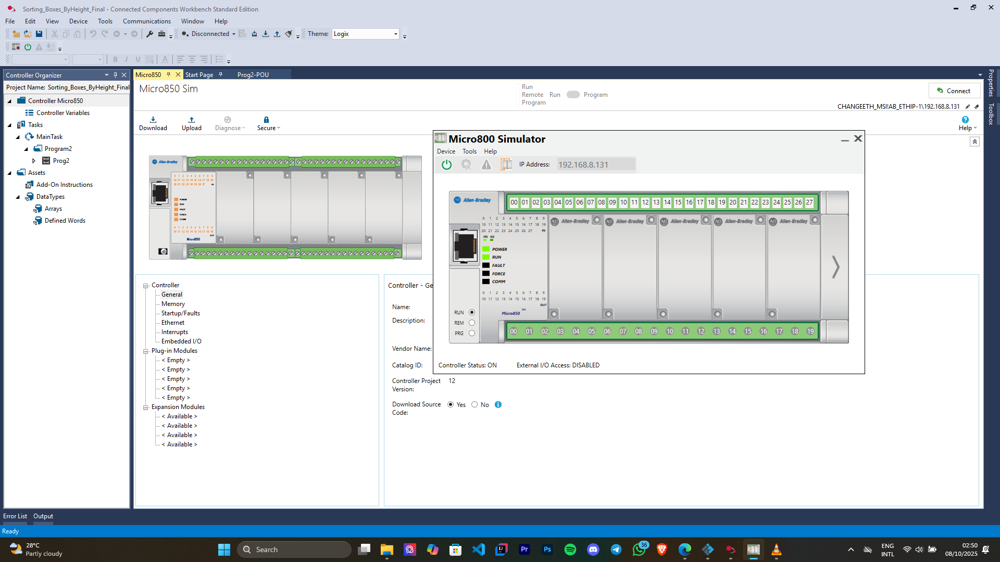

# 📦 Sorting Boxes by Height – Factory IO Simulation

## 🎯 Project Overview

The system automates a **Sorting Boxes by Height** process within a virtual factory designed in **Factory IO**.  
PLC logic was developed in **CCW**, downloaded to a **virtual Micro850 PLC**, and connected to Factory IO for real-time control and simulation.

---

## ⚙️ Hardware & Software Used

- **Software:**
  - Factory IO (Virtual 3D Factory Simulation)
  - Connected Components Workbench (CCW) – Version 23
- **PLC:**
  - Micro850 (2080-LC50) – Virtual PLC Simulation
- **Sensors:**
  - Digital Light Array (Emitter & Receiver)
  - Retroreflective Sensors (Entry & Exit)
  - Capacitive Sensor (Chain Transfer Detection)
- **Actuators:**
  - Conveyors (Entry, Left, and Right)
  - Chain Transfer Mechanism

---

## 🏭 System Description

The system consists of **three conveyor belts** and a **box height detection mechanism**:

- **Entry Conveyor:**  
  Brings all incoming boxes to the detection zone.

- **Digital Light Array (Height Detection):**  
  Consists of four vertical light beams used to classify boxes:
  - **Small Boxes:** Break the bottom two beams.
  - **Large Boxes:** Break all four beams.

- **Chain Transfer Section:**  
  Transfers boxes from the entry conveyor to either the left or right conveyor.  
  A **capacitive sensor** detects the presence of a box before transfer.

- **Right Conveyor:**  
  Transports **large boxes**.

- **Left Conveyor:**  
  Transports **small boxes**.

Each conveyor includes:
- An **Entry Retroreflective Sensor** to detect when a box enters.  
- An **Exit Retroreflective Sensor** to stop the conveyor once the box exits.

The automation ensures that each box is sorted correctly based on its height.

---

## 🧠 Control Logic (CCW Ladder Diagram)

The **ladder logic** in Connected Components Workbench handles:
- Sensor signal interpretation.  
- Height classification using the digital light array.  
- Actuation of conveyors and chain transfer based on classification.  
- Box tracking and sequential control to prevent overlapping operations.

---

## 🖼️ Snapshots

### 🧩 Factory IO Simulation Environment

  
  

  

---

### 🪜 Connected Components Workbench (CCW) Ladder Logic

  
  

  

---
## 📘 Key Learning Outcomes

- Integration of **Factory IO** with **CCW** and **Micro850 virtual PLC**.  
- Implementation of **industrial sensors** and **actuators** for sorting automation.  
- Ladder logic programming for **sensor-based decision-making**.  
- Real-time system testing in a simulated factory environment.

---

## 🧾 Author

**Changeethan Sujinthan**  
Undergraduate – Electrical Engineering  
University of Moratuwa  
🔗 [LinkedIn](https://www.linkedin.com/in/your-profile)  

---

